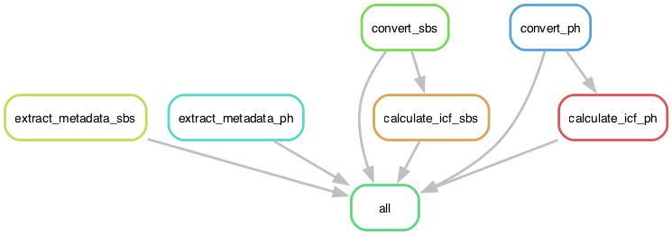

# 0_preprocessing

This module provides a workflow for preprocessing ND2 microscopy files, generating metadata, and creating image correction files. It is designed to handle both Sequential-Based Sequencing (SBS) and Phenotype (PH) acquisitions.

This workflow follows the Snakemake rule graph below:



## Contents

1. `0_preprocessing_smk_test.ipynb`: Jupyter notebook for testing well-based image patterns and ensuring correct image loading.
2. `0_preprocessing.smk`: Main Snakemake file with tile-based preprocessing rules.
3. `0_preprocessing_eval.ipynb`: Jupyter notebook for evaluating preprocessing results and checking metadata correspondence between PH and SBS images.


## Key Features

- Converts ND2 files to TIFF format
- Generates metadata for SBS and PH images
- Creates illumination correction files
- Supports both tile-based processing approaches


## Usage


### 1. Test input patterns and processing

Thoroughly read the descriptions for all parameters that need to be set in `0_preprocessing_smk_test.ipynb`.
Modify the input patterns, channels, and other parameters as needed for your specific setup.
Run the `0_preprocessing_smk_test.ipynb` notebook to ensure that the parameters perform as expected.


### 2. Run phenotype processing workflow

Adjust each parameter in `0_preprocessing.smk` to have the same values set in `0_preprocessing_smk_test.ipynb`.
We use the following commands to generate the rulegraph (above) and run the workflow.
```sh
# activate conda environment
conda activate ops_dev

# generate rulegraph
snakemake --snakefile 0_preprocessing.smk --rulegraph | dot -Gdpi=100 -Tpng -o 0_preprocessing_rulegraph.png

# run workflow
snakemake --snakefile 0_preprocessing.smk
```

### 3. Evaluate results

Adjust each parameter in `0_preprocessing_eval.ipynb` to have the same values set in `0_preprocessing_smk_test.ipynb`.
Run `0_preprocessing_eval.ipynb` to check if the generated images look correct and if the metadata corresponds between PH and SBS acquisitions.

## File structure

```
0_preprocessing_smk_test.ipynb
0_preprocessing.smk
0_preprocessing_eval.ipynb

input/
├── ph*/ # raw phenotype ND2 files, one per tile, well combination
└── sbs/ # raw SBS ND2 files, one per tile, well combination

output/
├── eval/ # generated by 0_preprocessing_eval.ipynb
├── illumination_correction*/ # generated by 0_preprocessing.smk
├── metadata/ # generated by 0_preprocessing.smk
├── ph_tif/ # generated by 0_preprocessing.smk
└── sbs_tif/ # generated by 0_preprocessing.smk
```

*Some example files are too large to store in this GitHub repo.


## Notes

While processing current has tile-based (multichannel) and well-based (single or multichannel) formats, we provide example analysis for only the tile-based format.
These workflows differ largely only in their alignment and image correction step.
