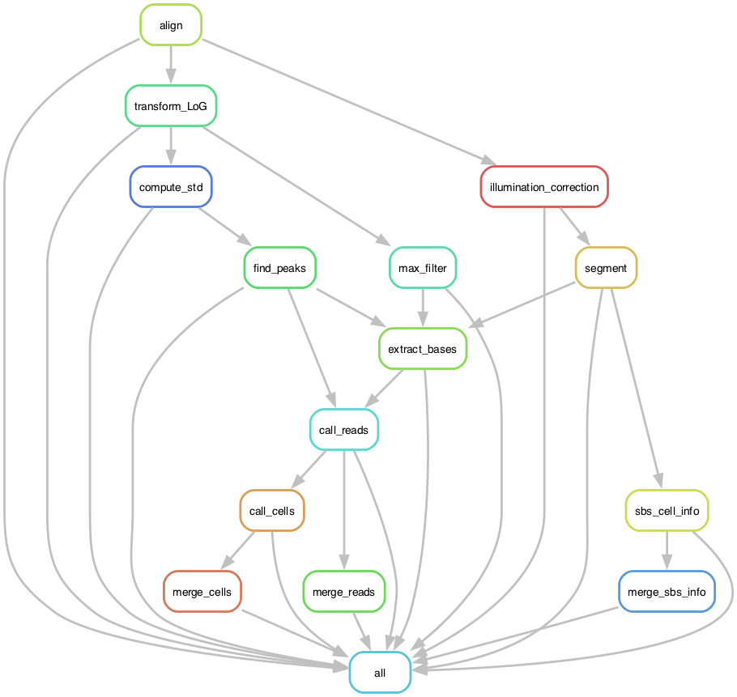

# 1_sbs

This module provides a workflow for processing Sequencing By Synthesis (SBS) microscopy files, generating metadata, and performing read calling and cell assignment.
It is designed to handle SBS acquisitions and integrate with the previous preprocessing step.

This workflow follows the Snakemake rule graph below:



## Contents

1. `1_sbs_smk_test.ipynb`: Python script for ensuring correct SBS image loading and processing at the tile level.
2. `1_sbs.smk`: Main Snakemake file that includes rules for SBS image processing, base calling, and cell assignment.
3. `1_sbs_eval.py`: Python script for evaluating SBS results and generating quality control plots.


## Key Features

- Aligns SBS images across cycles
- Performs illumination correction
- Segments cells and nuclei
- Extracts base intensities and calls reads
- Assigns reads to cells
- Generates quality control plots and statistics


## Usage


### 1. Test input patterns and processing

Thoroughly read the descriptions for all parameters that need to be set in `1_sbs_smk_test.ipynb`.
Modify the input patterns, channels, and other parameters as needed for your specific setup.
Run the `1_sbs_smk_test.ipynb` notebook to ensure that the parameters perform as expected.


### 2. Run SBS processing workflow

Adjust each parameter in `sbs_1.smk` to have the same values set in `1_sbs_smk_test.ipynb`.
We use the following commands to generate the rulegraph (above) and run the workflow.
```sh
# activate conda environment
conda activate ops_dev

# generate rulegraph
snakemake --snakefile 1_sbs.smk --rulegraph | dot -Gdpi=100 -Tpng -o 1_sbs_rulegraph.png

# run workflow
snakemake --snakefile 1_sbs.smk
```

### 3. Evaluate results

Adjust each parameter in `sbs_1_eval.py` to have the same values set in `1_sbs_smk_test.ipynb`.
Run `sbs_1_eval.py` to generate quality control plots and statistics for the SBS processing results with the following command:
```sh
# run evaluation code
python 1_sbs_eval.py
```

## File structure

```
1_sbs_smk_test.ipynb
1_sbs.smk
1_sbs_eval.py

input/
├── sbs_tifs/ # raw SBS images, one tif of per cycle, tile, well combination
└── sbs_ic_tifs # illumination corrected images, one tif per well for a selected cycle

output/
├── test*/ # generated by 1_sbs_smk_test.ipynb
├── images*/ # generated by 1_sbs.smk (these images are usually removed once pipeline is finished)
├── csvs/ # generated by 1_sbs.smk
├── hdfs/ # generated by 1_sbs.smk
└── eval/ # generated by 1_sbs_eval.py
```

*The example output images are too large to store in this GitHub repo.


## Notes

While processing current has tile-based (multichannel) and well-based (single or multichannel) formats, we provide example analysis for only the tile-based format.
These workflows differ largely only in their alignment and image correction step.
