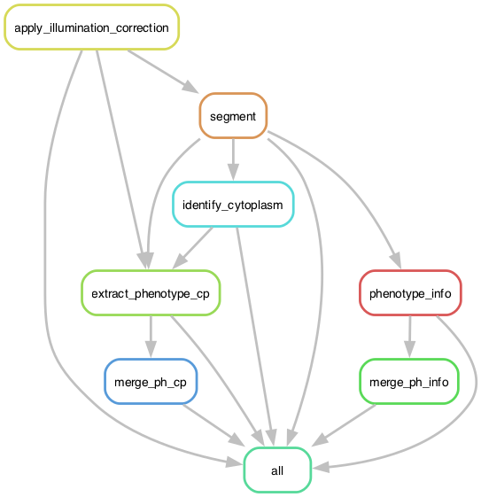

# 2_ph

This module provides a workflow for processing phenotype microscopy files, performing cell segmentation, and extracting phenotypic features. 
It is designed to handle phenotype acquisitions and integrate with the previous preprocessing step.

This workflow follows the Snakemake rule graph below:



## Contents

1. `2_ph_smk_test.ipynb`: Python script for ensuring correct SBS image loading and processing at the tile level.
2. `2_ph.smk`: Main Snakemake file that includes rules for SBS image processing, base calling, and cell assignment.
3. `2_ph_eval.py`: Python script for evaluating SBS results and generating quality control plots.


## Key Features

- Aligns PH images across channels
- Performs illumination correction
- Segments cells and nuclei and identifies cytoplasmic regions
- Extracts phenotypic features using a CellProfiler emulator
- Generates quality control plots and statistics


## Usage


### 1. Test input patterns and processing

Thoroughly read the descriptions for all parameters that need to be set in `2_ph_smk_test.ipynb`.
Modify the input patterns, channels, and other parameters as needed for your specific setup.
Run the `2_ph_smk_test.ipynb` notebook to ensure that the parameters perform as expected.


### 2. Run phenotype processing workflow

Adjust each parameter in `2_ph.smk` to have the same values set in `2_ph_smk_test.ipynb`.
We use the following commands to generate the rulegraph (above) and run the workflow.
```sh
# activate conda environment
conda activate ops_dev

# generate rulegraph
snakemake --snakefile 2_ph.smk --rulegraph | dot -Gdpi=100 -Tpng -o 2_ph_rulegraph.png

# run workflow
snakemake --snakefile 2_ph.smk
```

### 3. Evaluate results

Adjust each parameter in `2_ph_eval.py` to have the same values set in `2_ph_smk_test.ipynb`.
Run `2_ph_eval.py` to generate quality control plots and statistics for the phenotype processing results with the following command:
```sh
# run evaluation code
python 2_ph_eval.py
```

## File structure

```
2_ph_smk_test.ipynb
2_ph.smk
2_ph_eval.py

input/
├── ph_tifs/ # raw SBS images, one tif of per tile, well combination
└── 2_ph_ic_tifs # illumination corrected images, one tif per well

output/
├── test*/ # generated by 2_ph_smk_test.ipynb
├── images*/ # generated by 1_sbs.smk (these images are usually removed once pipeline is finished)
├── csvs/ # generated by 1_sbs.smk
├── benchmarks/ # generated by 1_sbs.smk
├── hdfs/ # generated by 1_sbs.smk
└── eval/ # generated by 1_sbs_eval.py
```

*The example output images are too large to store in this GitHub repo.


## Notes

While processing current has tile-based (multichannel) and well-based (single or multichannel) formats, we provide example analysis for only the tile-based format.
These workflows differ largely only their alignment and image correction step.
